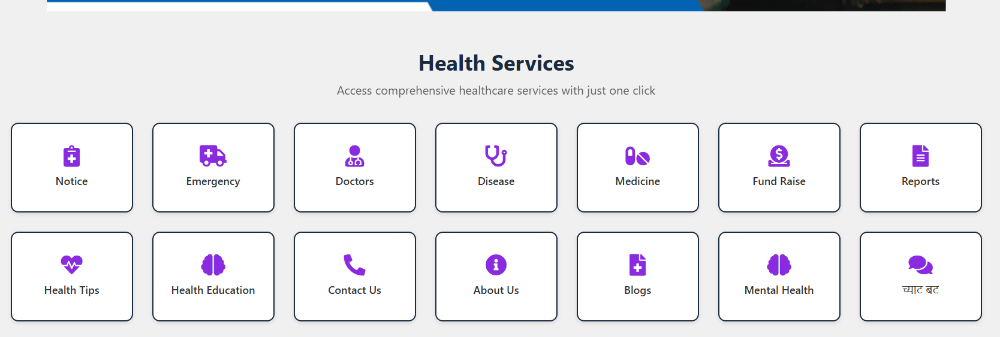
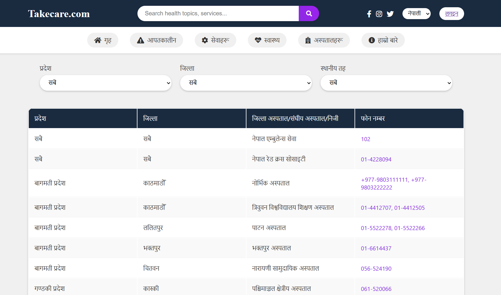
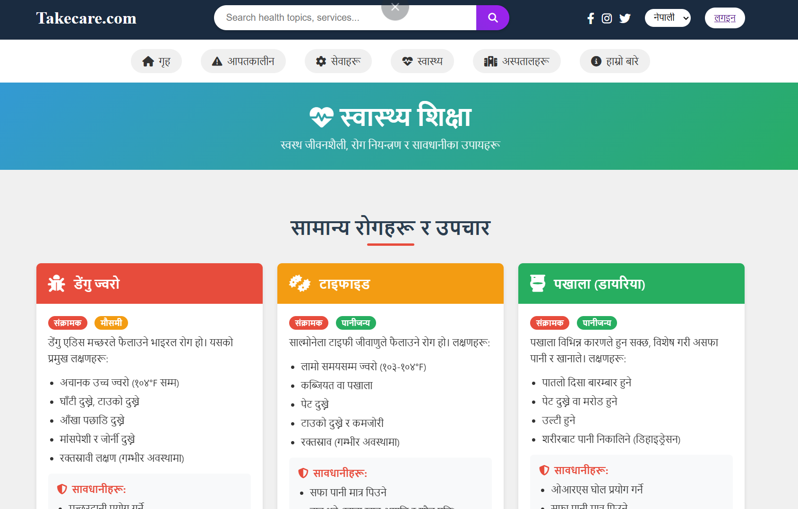
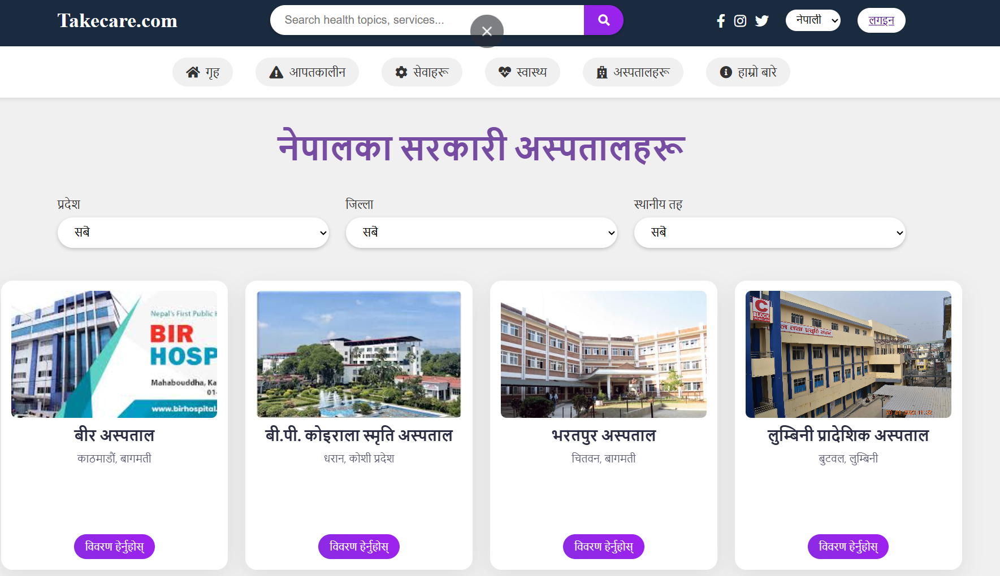
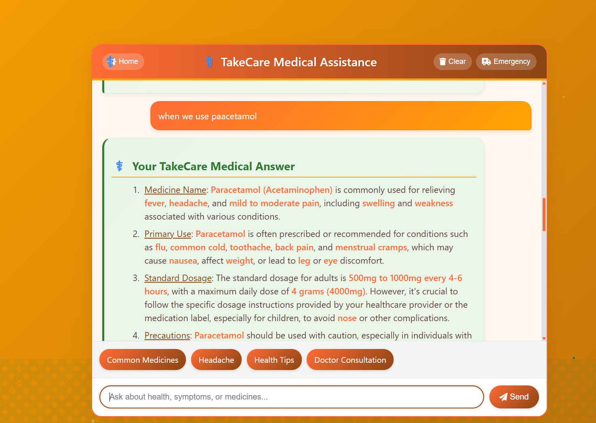
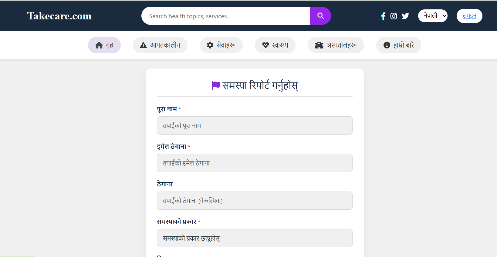
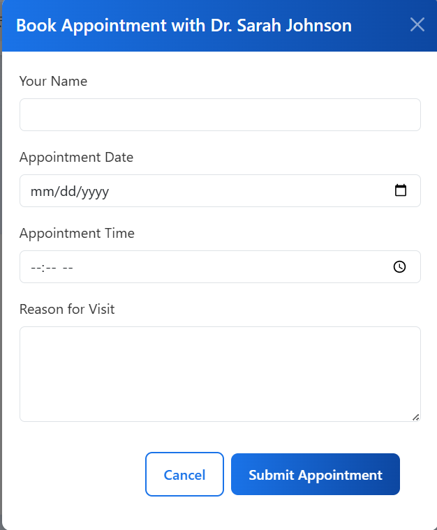
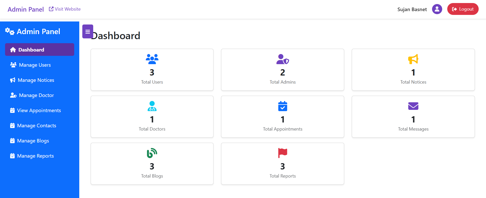

<h1 align="center">🩺 TAKECARE – Smart Nepali Digital Health Care System</h1>

  <i>A complete digital healthcare solution that connects people with emergency support, medical guidance, doctors, mental health resources, crime reporting, fund raising and more – all in one powerful platform.</i>

  <b>HTML • CSS • JavaScript • PHP • MySQL</b>

---

## 📝 About The Project

TAKECARE is a modern and user-friendly Nepali digital healthcare web platform designed to provide essential medical services online.  
It helps users quickly access **emergency contacts**, **disease & medicine information**, **doctor appointment system**,  
**health tips**, **mental health support**, **blogs**, **fund raising**, **crime report**, and a **smart chatbot** for instant assistance.

This system is built using **PHP and MySQL** and is fully responsive with **HTML, CSS, and JavaScript**.  
It also includes a **complete Admin Dashboard** for managing doctors, blogs, notices, reports, fundraise requests, and more.

---

## 🖼 Demo Screenshots

  
    
  
    
  
    
 
    
  
    
  
    
  
    
  
    
  
    

---

# 🚀 Features Overview

### 🏥 Health Services
- Emergency contacts (district-wise)
- Disease information
- Medicine guide
- Health tips & educational content
- Doctor profiles with details

### 👩‍⚕️ Appointment System
- Doctor listings
- Specialization, qualification, experience
- Appointment booking
- Admin approval system

### 🤖 Smart Chatbot
- Medicine suggestions  
- Symptoms overview  
- First-aid guidance  
- Health Q/A  

### 🧠 Mental Health Section
- Stress, anxiety, depression info  
- Self-help sections  
- Mental well-being articles  

### 📢 Notice Board
- Local health notices  
- PDF/image uploads  
- Important announcements  

### 🚨 Crime Report
- Anonymous report submission  
- Upload evidence  
- Admin review  

### 💝 Fund Raise System
- Patient stories  
- Donation support  
- Admin approval  

### 📝 Blogs
- Health blogs  
- Cover image support  
- Admin controls  

### 🧑‍💻 Admin Dashboard
- Manage doctors  
- Manage blogs  
- Approve fundraise  
- Review crime reports  
- Manage notices & health tips  
- Database-connected dashboard  

---

# ⚙️ Installation & Setup Guide (SUPER EASY)

### 🔰 **1. Download ZIP File**
Download the project ZIP and **extract** it.

---

### 📁 **2. Move Project Folder**
After extracting, move the folder named **takecare** to:

#### 
http://localhost/phpmyadmin

#### 📌 Setup Tips (INSIDE the Database section):
- Open phpMyAdmin  
- Create a new database named **takecare_db**  
- Click **Import** and select **takecare_db.sql**  
- After successful import, the project will work immediately  
- If tables do not appear → check database name spelling  
- Make sure Apache & MySQL are running in XAMPP 

#### ✔ Admin Login:
- admin email : admin@example.com 
- Password : admin123

---

### 🛢️ **4. Import SQL File**
Open browser:
http://localhost/takecare

---

# 🌟 Future Upgrades
- Live ambulance tracking  
- AI Medical Assistant v2 (advanced NLP)  
- Online medicine ordering  
- Payment gateway support (eSewa / Khalti)  
- Mobile app version (Flutter/React Native)  

---

<h3 align="center">💙 Developed with care by <b>Rojesh Humagain</b></h3>
<h4 align="center">⭐ If you like this project, please give it a star!</h4>

